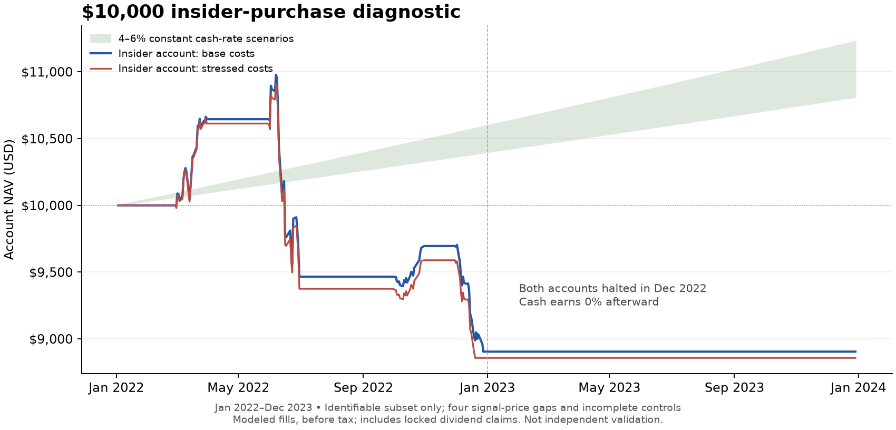

# $10,000 insider-purchase diagnostic: negative on the identifiable subset

**The simulated non-routine insider account lost $1,095.69 under base costs
and $1,142.50 under stressed costs. Both accounts triggered their preset loss
halt in December 2022. I recommend shelving this version.**

This is an exploratory result on the source-qualified, priceable subset.
Four non-routine signal months lack usable cached price histories, and seven
selected signal months lack a same-decile control. The complete strategy and
complete matched comparison remain unresolved. The result does not establish
that every insider strategy fails, and it does not justify funding a pilot.

## What was authorized and tested

The user approved one capped economic diagnostic and increased simulated
capital from $5,000 to **$10,000** before any insider price outcomes were opened.
The three-hour/$0 allowance was a maximum. No new provider requests, paid data,
credentials, brokerage account access, or orders were used. The published IBKR
fee page was read; every filing and price used in the calculation was cached.

The original [80/40 sample-gate stop](../insider-purchase-test-2026-09-13/RESULTS.md)
is preserved. This separately registered diagnostic carries no validation PASS.
The cohort, classification, signal timing, monthly holding rule and costs remain
fixed. Dollar position limits, cash reserve and loss halt scale with capital:

- Four whole-share positions, each limited to the lesser of $2,000 or 20% of
  previous account NAV, subject to a $2,000 settled-cash reserve.
- Prior-month public disclosures; first-session closing-limit entry proxy,
  month-end exit, fixed hash selection, no retry after an unfilled entry.
- $2,000 drawdown from the running NAV high triggers permanent entry suspension
  and liquidation at the next executable session. This is 20% of initial
  capital; it is not a guaranteed maximum loss or a 20%-of-peak trigger.
- Base/stress execution costs are 10/50 basis points per side plus the archived
  [IBKR Pro Fixed fee assumptions](https://www.interactivebrokers.com/en/pricing/commissions-stocks.php).
  The commission is $0.005/share with a $1 minimum and 1% trade-value cap;
  separate regulatory components are rounded upward. This is a current-rate
  counterfactual, not the user's verified tariff or a historical fee schedule.
- Sale proceeds remain unavailable for seven calendar days, a conservative
  modeling rule. Verified dividend entitlements enter NAV but stay unspendable
  until payment availability is evidenced. Cash earns zero; taxes are excluded.

[Policy and registration](experiment-policy.json), [policy checksum](experiment-policy.json.sha256).

## Account results

Evaluation: **January 3, 2022–December 29, 2023**, 501 market sessions and
726 inclusive calendar days. Annualized returns include the cash-only period
after the loss halt; they are not returns for a continuously invested strategy.

| Identifiable non-routine account | Base costs | Stressed costs |
|---|---:|---:|
| Initial capital | $10,000.00 | $10,000.00 |
| Ending NAV | **$8,904.31** | **$8,857.50** |
| Net profit/loss | **−$1,095.69** | **−$1,142.50** |
| Total return | −10.96% | −11.42% |
| Annualized return | −5.67% | −5.92% |
| Maximum peak-to-trough drawdown | 18.88% | 18.83% |
| Maximum drawdown in dollars | $2,072.62 | $2,055.24 |
| Completed positions | 9 | 9 |
| Months with stock exposure | 4 | 4 |
| Loss halt observed | December 27, 2022 | December 19, 2022 |
| Final liquidation | December 28, 2022 | December 20, 2022 |

The dollar drawdown exceeds $2,000 because liquidation follows the observed
trigger. Percent drawdown is less than 20% because the account previously rose
above its initial $10,000. Stressed costs affect quantities and bring the halt
forward, so the final losses differ by more than a simple fee subtraction.

Base-account commissions/regulatory fees were **$18.70**, and modeled slippage
was **$33.51**. Removing those costs from the same fills still leaves a
**$1,043.48 loss**. That is a same-quantity/same-date diagnostic; a separate
zero-cost account with different sizing or halt timing was not run.

Base ending NAV includes **$69.38 in locked dividend claims**; settled cash is
$8,834.93. Average stock exposure was 6.75% across the full evaluation, including
the period after the permanent halt. This was not steady supplemental income.

## Where the result came from

The nine positions span eight companies. Three positions gained and six lost.
The largest single loss was DDD, approximately $592 in the base case; however,
the four-position June basket also lost approximately $1,180 in aggregate.

| Active month | Base net profit/loss |
|---|---:|
| March 2022: CAT, AYX | +$645.43 |
| June 2022: CAT, BOOT, CGNX, KMT | −$1,179.64 |
| October 2022: CASY | +$229.67 |
| December 2022: FSK, DDD | −$791.16 |

Other months have zero account return under the prescribed zero-interest cash
assumption. The machine-readable result retains all 24 monthly observations,
individual position P&L, fills, exclusions and daily account ledgers.

## Controls and uncertainty

| Available control account | Base ending NAV | Stress ending NAV | Completed positions |
|---|---:|---:|---:|
| Routine insider purchases | $10,238.88 | $10,206.52 | 2 |
| Available non-event matches | $10,432.20 | $10,337.41 | 6 |

These are sparse, incomplete comparison accounts, not a successful estimate of
the insider premium. Routine fills are just two PRGO positions. Only 11 of the
18 selected non-routine opportunities have an exact price/volume-decile match;
seven lack one. Independent account fills and the strategy's halt also produce
different exposure histories. Missing controls were not replaced with looser
matches or recorded as successful observations.

For the observed base accounts, the descriptive block-bootstrap interval for
annualized arithmetic mean daily return difference is approximately **−20.8 to
+5.7 percentage points versus routine**, and **−20.7 to +2.7 points versus the
available matched account**. These wide intervals are not CAGR intervals or a
complete matched-sample test. The short, previously explored period, repeated
issuer exposure and prior strategy search limit inference. The bootstrap is
not adjusted for the cumulative research search and does not solve those limits.

Constant 4%/6% cash scenarios would end at **$10,811.35/$11,228.83** over the same
dates. Those are the user's reference-rate scenarios, not reconstructed
historical cash yields. The observed strategy falls below both.

## Coverage and exclusions

All **200 companies and 4,800 issuer-month slots** remain recorded. Source-only
classification was frozen before loading prices. It identifies 32 non-routine
and seven routine company-months. Records with inadequate history, ambiguous
joint owners, unresolved amendments or notes cause explicit abstention.

The diagnostic corrected XML dates with timezone suffixes without changing
their local calendar day, reviewed 29 necessary note texts (two already in
the inherited codebook), and preserved uncertain decisions. It also prevents
an unresolved relevant purchase from disappearing when aggregating an otherwise
eligible company-month. These were source/implementation checks, not changes
chosen using returns. No source-only eligible count rose after these reviews.

Before order simulation, the fixed prior-price and $2 million median daily
dollar-volume requirements leave **18 non-routine and six routine candidates**.
Ten non-routine and one routine source signals are liquidity-ineligible.
Four non-routine signal months have unresolved cached price histories:

- SELB: June and July 2022 entries.
- KMPH: November 2022 entry.
- AMBC: October 2023 entry.

Their historical-symbol cache files contain empty responses. Cached ZVRA data
exists, but projecting it backward onto KMPH would require a separately
qualified identity/share-basis bridge; this diagnostic does not silently make
that substitution. Three missing opportunities precede the observed halt and
could change a hypothetical complete-data account. AMBC occurs after the halt
in the observed path. **Therefore the numeric loss is conditional on available
inputs, not a complete-data profitability verdict.**

Across the full potential control universe, 645 issuer-months have unresolved
prior price/identity checks, 1,131 fail liquidity and 491 fail known listing
status; 2,533 are qualified. Decile matches use this known qualified subset.
These gaps limit the whole-cohort control inference as well.

Of the 18 selected non-routine opportunities, nine fill, one closing-limit
order cancels, and eight arrive after the permanent halt. No future endpoint
availability or return selected the order pool. The available routine account
has six candidates and two fills; the available matched account has 11 and six.

## Verification and disposition

Seven focused synthetic checks passed, covering dates, classification causality,
monthly fills, cost components, cash locks, dividend claims and missing marks.
A separate Decimal replay reconciled **all 3,006 daily NAV records** across the
six accounts and recomputed **68 fills directly from 14 cached raw price files**.
All held marks are present, all positions closed and all original policy/source
freeze hashes still match. This is an internal calculation cross-check, not
external replication or certification of the missing universe.

The price adapter initially read the current SEC roster rather than the exact
prior panel snapshot. A separate comparison checked **214,000 daily
issuer-symbol mappings** against that qualified snapshot and found zero
differences. The provenance difference is retained in its own audit record.

**Shelve this version.** We obtained negative economic evidence within the cap
without paying for new data. Larger capital alone did not make this observed
implementation attractive. The incomplete broader hypothesis remains open as
a research question, but this result provides no reason to expand the cohort,
tune parameters, open 2024–2025 strategy prices or start a funded pilot.

[Full numeric result](evaluation-result.json), [account verification](account-verification.json),
[source freeze](signal-freeze.json), [candidate coverage](account-candidate-freeze.json),
[roster cross-check](source-roster-cross-check.json).
