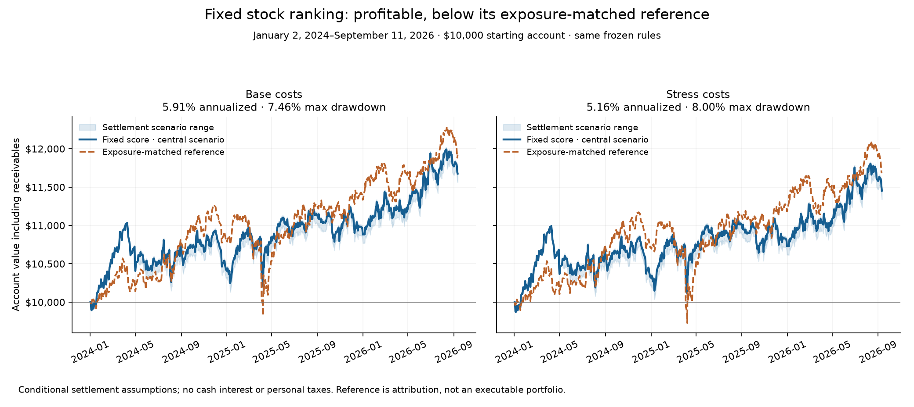

# Recent fixed-score test: completed conditional results

**The strategy made money in this backtest, but its stock ranking did not beat the exposure-matched reference.** The central scenario earned 5.91% annualized after base costs and 5.16% after stressed costs. These results support keeping a baseline, not a claim of a proven income-producing bot.

The evaluation runs January 2, 2024–September 11, 2026, starting with $10,000. The six-signal rule, original 100-security cohort, entries, retention, sizing, cash reserve and loss halt were fixed before the recent-price requests. No trained model was fitted and no ranking parameter was searched.

The [initial strict result](RESULTS.md) remains unresolved at the Pioneer-to-Exxon conversion. A separate [completion protocol](completion-protocol.json) declared 12 settlement scenarios before calculating their outcomes. The central scenario (1× published fractional-cash reference, five-session share availability delay) was selected in [completion-freeze.json](completion-freeze.json) before those runs. It is conditional accounting, not an observed brokerage account.

## Central scenario

| $10,000 account | Base costs | Stressed costs |
|---|---:|---:|
| Ending account value | $11,675.22 | $11,453.15 |
| Net profit | $1,675.22 | $1,453.15 |
| Annualized return | 5.91% | 5.16% |
| Maximum peak-to-trough drawdown | 7.46% | 8.00% |
| Average stock exposure | 61.76% | 62.37% |
| Trading fees | $78.91 | $78.91 |
| Slippage | $55.52 | $277.59 |
| Loss halt triggered | No | No |

Returns include the frozen IBKR Pro Fixed fee counterfactual and 10/50 basis points of slippage per side, using daily closing prices. They exclude personal taxes. Cash and receivables earn zero interest. Actual account fees and fills are not established by this simulation.

For the same dates, hypothetical constant 4% and 6% annual cash hurdles end at $11,115.27 and $11,700.97. The central account exceeds the 4% hurdle under both cost assumptions and falls short of 6%. Those are comparison assumptions, not a claim that either rate was continuously available. Stock drawdowns make equal percentage returns economically different.

## Calendar-year behavior

One account continues across all three years; there are no annual capital or halt resets. The 2026 figure is year-to-date.

| Period | Base return | Stressed return |
|---|---:|---:|
| 2024 | 4.34% | 3.41% |
| 2025 | 4.28% | 3.75% |
| 2026 through September 11 | 7.30% | 6.75% |

## Does the ranking add value?

The reference uses the equal mean daily return of the same month’s eligible securities, at the strategy’s actual prior-close stock exposure, with the same dated fee/slippage rate. It also includes floating fractional-entitlement exposure until that entitlement becomes a fixed cash claim. This is an attribution reference, not a tradable whole-share portfolio or a sector/beta-adjusted alpha estimate.

| Central scenario | Base | Stress |
|---|---:|---:|
| Reference ending value | $11,922.33 | $11,698.76 |
| Strategy minus reference | $-247.11 | $-245.60 |

Base: mean monthly strategy-minus-reference return -0.09%; 95% stationary-block interval [-0.41%, 0.25%], from 32 complete months, 2,000 resamples and expected block length 12 months. September 2026 is excluded. These short, dependent samples and selection after earlier experiments limit inference.

Stress: mean monthly strategy-minus-reference return -0.09%; 95% stationary-block interval [-0.42%, 0.25%], from 32 complete months, 2,000 resamples and expected block length 12 months. September 2026 is excluded. These short, dependent samples and selection after earlier experiments limit inference.

Every settlement case trails its exposure-matched reference. A positive strategy return therefore does not establish that this particular ranking earned an advantage over taking comparable stock exposure.

## All declared settlement cases

| Fractional-cash multiple | Share delay (sessions) | Costs | Profit | Annualized return | Max drawdown | Strategy minus reference |
|---:|---:|---|---:|---:|---:|---:|
| 0× | 0 | base | $1,562.12 | 5.53% | 8.48% | $-377.21 |
| 0× | 0 | stress | $1,340.05 | 4.78% | 9.02% | $-373.82 |
| 0× | 5 | base | $1,562.12 | 5.53% | 8.48% | $-377.21 |
| 0× | 5 | stress | $1,340.05 | 4.78% | 9.02% | $-373.82 |
| 1× | 0 | base | $1,675.22 | 5.91% | 7.46% | $-247.11 |
| 1× | 0 | stress | $1,453.15 | 5.16% | 8.00% | $-245.60 |
| 1× | 5 | base | $1,675.22 | 5.91% | 7.46% | $-247.11 |
| 1× | 5 | stress | $1,453.15 | 5.16% | 8.00% | $-245.60 |
| 1.25× | 0 | base | $1,703.50 | 6.01% | 7.20% | $-214.64 |
| 1.25× | 0 | stress | $1,481.43 | 5.26% | 7.74% | $-213.60 |
| 1.25× | 5 | base | $1,703.50 | 6.01% | 7.20% | $-214.64 |
| 1.25× | 5 | stress | $1,481.43 | 5.26% | 7.74% | $-213.60 |

All 12 accounts have complete conditional accounting, 39 purchases and 77 total fills; none triggers the permanent $2,000 trailing dollar-loss halt. No forced distribution pushes holdings above the 10-position entry cap. Sensitivity cases are not independent strategy trials and are not exhaustive bounds.

Only the Pioneer stock conversion is encountered while held: three PXD shares create six whole XOM shares and a 0.9702-share fractional claim on May 3, 2024. The claim follows the dated XOM close until May 10; the central fixed amount is $113.10, with $0 and $141.38 alternatives. It never finances purchases. The XOM shares sell on June 4, after both declared availability dates, explaining why the zero/five-session delay cases are identical.

The [Exxon completion announcement](https://www.sec.gov/Archives/edgar/data/34088/000095010324006322/dp210867_ex9901.htm) supports the 2.3234 exchange ratio. The [May 10 OCC memo](https://infomemo.theocc.com/infomemos?number=54574) publishes a fractional-cash unit price of $116.5789 for its option adjustment. That is evidence for the scenario reference, not proof of this user’s ordinary-share brokerage receipt. Aptiv/VGNT and LEG/SGI were included in the declared action handling but were not held at their stock-distribution dates.

## Account value and spendable cash

The ending account value includes receivables. Under the unchanged conservative accounting rules, all stocks are liquidated at the evaluation cutoff, and recent sale proceeds remain locked for seven calendar days. Ordinary dividends and the Sealed Air cash-merger entitlement remain non-spendable because actual payment dates were not sourced. These claims are valued in NAV; the reported ending value is not all immediately withdrawable cash.

| Central case at cutoff | Base | Stress |
|---|---:|---:|
| Settled cash | $3,054.80 | $2,862.56 |
| Unsettled sale proceeds | $7,439.29 | $7,409.47 |
| Dividend receivables | $309.33 | $309.33 |
| Cash-merger receivable | $758.70 | $758.70 |
| Conditional fractional-cash claim | $113.10 | $113.10 |

The Sealed Air receivable is 18 shares × $42.15 = $758.70, supported by its [April 9 completion announcement](https://sealedair.gcs-web.com/news-releases/news-release-details/sealed-air-announces-completion-acquisition-cdr). None of this changes the original seven-day sale-lock or unsupported-payment-date rules.

## Earlier results and coverage

The already-seen 2022–2023 fixed-score test earned 2.97% annualized under base costs and 1.95% under stress. Those files are unchanged. This test resets the account to $10,000 in January 2024, so the two experiments cannot be presented as one continuous 2022–2026 trading return. Stronger recent performance does not establish that older regimes are obsolete.

All 3,300 original company-month slots are retained across 33 months; 84–88 stocks are eligible per month, producing 2,859 fixed scores. Eligible labels are complete for January 2024–August 2026; unfinished September full-month labels are excluded. The cohort is a deterministic sample from a 2018 roster, not today’s full market or a list of AI winners. Missing financial factors receive the original neutral score, so “eligible” does not mean every factor is available.

- book_price: 31–44 original securities with that feature per month.
- earnings_price: 29–40 original securities with that feature per month.
- roa: 71–75 original securities with that feature per month.
- cfo_assets: 81–85 original securities with that feature per month.

The recent cohort prices and results are now seen research data. Future changes evaluated on these years are exploratory; preserve fresh evidence for any later validation.

## Verification and artifacts

Independent Decimal replays reconcile all 8,112 daily account observations, 924 fills and all 12 exposure-reference paths. Each conditional account exactly reproduces the initial strict account’s first 85 priced days. Synthetic tests cover conversion and spinoff value, whole-share delivery, trading delay, non-spendable fractions, quote timing, missing child prices, and exact no-action regression.

Before outcomes, 35,900 financial components passed filing-date and availability checks, all 2,859 eligible scores matched independent percentile arithmetic, and 46,593 overlapping raw provider rows matched the earlier snapshot. Original experiment files, original strict result, predictions and completion implementation hashes remain unchanged.

Acquisition completed with 96 Tiingo price requests (including the three date probes) and 94 SEC company-fact responses at $0 new paid data cost. The 12 accounting scenarios use cached data only. Raw provider payloads and detailed ledgers remain local and gitignored; hashes and concise derived results are committed.

- [Full conditional results](completion-results.json)
- [Independent account verification](completion-verification-after.json)
- [Completion implementation freeze](completion-freeze.json)
- [Original strict result](evaluation-result.json)
- [Research decision](completion-decision.json)

## Research decision

Keep the fixed score as a baseline, with this version unproven for allocating additional capital. The later window improves absolute profitability but weakens the earlier suggestion of a selection advantage. More tuning on these years would consume research effort without creating independent evidence.

A prospective paper comparison of the locked score against a predeclared unranked control could check signal availability and execution, if pursued next. A few months would test mechanics; it would not by itself establish dependable annual income. No new strategy search or paid data is needed to interpret this completed result.

