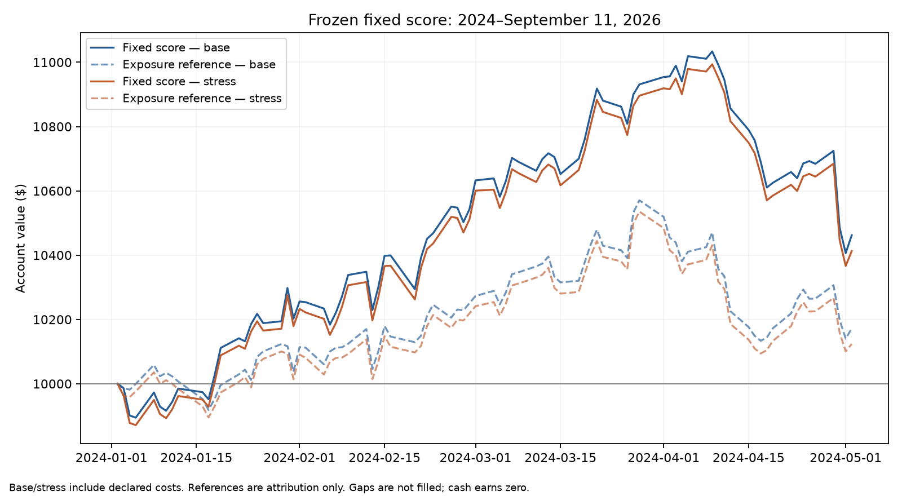

# Fixed-score recent-window results

Full account profitability remains unresolved in at least one cost case. Do not label missing accounting as a measured strategy loss or success.

Evaluation: January 2, 2024–September 11, 2026. Rules were frozen before the recent-price requests; there were no model fits or parameter searches. Each cost case starts once with $10,000. The 2022–2023 results were already seen and are presented separately.

| New evaluation | Base costs | Stressed costs |
|---|---:|---:|
| Account status | UNRESOLVED | UNRESOLVED |
| Ending account value | Unresolved | Unresolved |
| Net profit | Unresolved | Unresolved |
| Annualized return over the full new window | Unresolved | Unresolved |
| Maximum drawdown | Unresolved | Unresolved |
| Loss halt triggered | No | No |
| Halt date | None | None |
| Average stock exposure on priced days | 65.03% | 65.24% |
| Trading fees | $25.62 | $25.62 |
| Slippage | $18.80 | $94.01 |

## Calendar-year behavior

Annual figures follow the same continuous account; capital and loss halts are not reset each January. 2026 is a partial-year return, not an annual projection.

| Period | Base return | Stress return |
|---|---:|---:|
| 2024 | Unresolved | Unresolved |
| 2025 | Unresolved | Unresolved |
| 2026 through September 11 | Unresolved | Unresolved |

## Comparison with stock exposure

The reference replaces the stock leg with the equal mean return of the same prior-cut eligible cohort, using the strategy’s actual prior-close stock exposure. It subtracts the same dated fee/slippage rate relative to original strategy NAV. It is fractional attribution, not an executable whole-share portfolio, and does not remove sector or beta differences.

| New-window attribution | Base | Stress |
|---|---:|---:|
| Reference ending value | Unresolved | Unresolved |
| Strategy minus reference | Unresolved | Unresolved |

Base reference is incomplete: `{"account_nav_missing": true, "date": "2024-05-03", "reference_missing": []}`. No full-period selection advantage is claimed.

Base mean monthly strategy-minus-reference return: 0.72%; 95% stationary-block interval [0.28%, 1.16%], using 4 fully observed months. September 2026 is excluded from this monthly interval. Few years and market dependence limit inference.

Stress reference is incomplete: `{"account_nav_missing": true, "date": "2024-05-03", "reference_missing": []}`. No full-period selection advantage is claimed.

Stress mean monthly strategy-minus-reference return: 0.72%; 95% stationary-block interval [0.28%, 1.16%], using 4 fully observed months. September 2026 is excluded from this monthly interval. Few years and market dependence limit inference.

## Already-seen 2022–2023 comparison

| Earlier diagnostic | Base | Stress |
|---|---:|---:|
| Net profit | $599.63 | $390.74 |
| Annualized return | 2.97% | 1.95% |

These earlier results are unchanged. The new account starts from $10,000 in 2024; this report does not splice the two separately liquidated accounts into a continuous 2022–2026 trading return.

## Coverage and accounting

All 3,300 original company-month slots are retained. Monthly eligible counts range from 84 to 88 out of the original 100. The cohort was selected from a 2018 roster; it is not the full current market or a retrospective list of AI winners.

| Period | Eligible company-months | Known full-month labels |
|---|---:|---:|
| 2024 | 1053 | 1053 |
| 2025 | 1038 | 1038 |
| 2026 through August | 684 | 684 |

Newer splits and corporate events are listed in [recent_sources.py](recent_sources.py). Unqualified held distributions or missing marks leave account performance unresolved; those holdings are not deleted. Known dividends without supported payment dates remain non-spendable receivables. Cash and receivables earn zero interest. Returns include the declared trading costs but exclude personal taxes.

Costs preserve the earlier IBKR Pro Fixed counterfactual plus 10/50 basis points of slippage per side. These are historical close-based execution proxies, not verified broker fills or actual account tariffs. The account keeps a $2,000 settled-cash reserve and a permanent $2,000 trailing dollar-loss halt; that halt is not a guaranteed maximum realized loss.

Acquisition used 96 Tiingo price requests in this scope (including the original three probes) and 94 SEC company-fact responses. New paid data cost: $0. API limits were respected; calendar waiting is not research effort.

## Verification

Before outcomes: 35,900 financial components passed filing-date checks; independent percentile arithmetic checked every eligible score; future labels could not alter scores. Synthetic checks cover execution timing, costs, splits and unresolved distributions.

- Base: 85/676 daily NAV observations and 25 fills reconciled independently; valid prefix only.
- Stress: 85/676 daily NAV observations and 25 fills reconciled independently; valid prefix only.

Source and implementation hashes are in [evaluation-freeze.json](evaluation-freeze.json). Original experiment artifacts remain byte-for-byte unchanged. Raw provider data and account ledgers remain local and gitignored.

